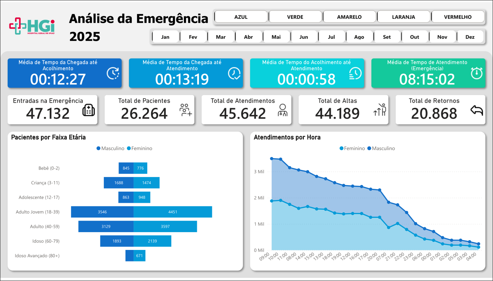
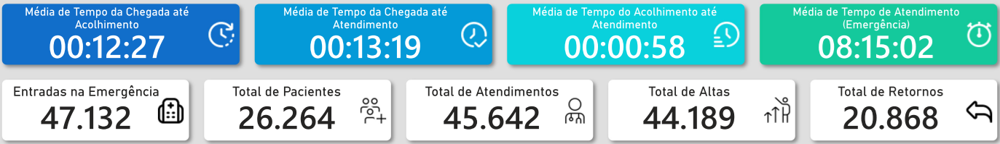
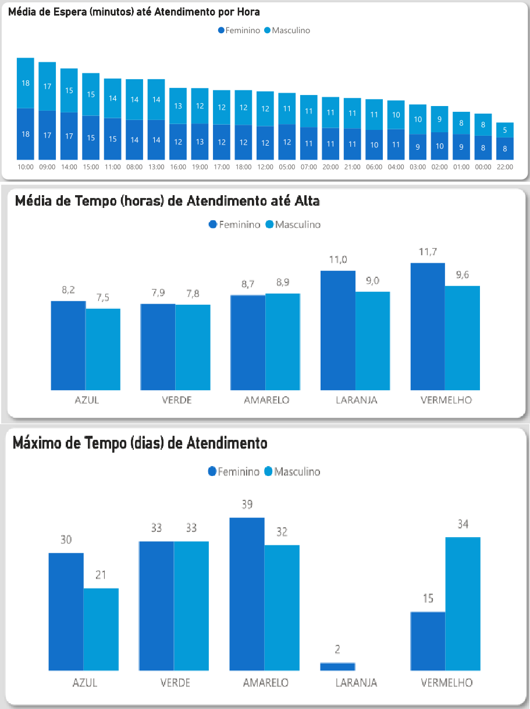
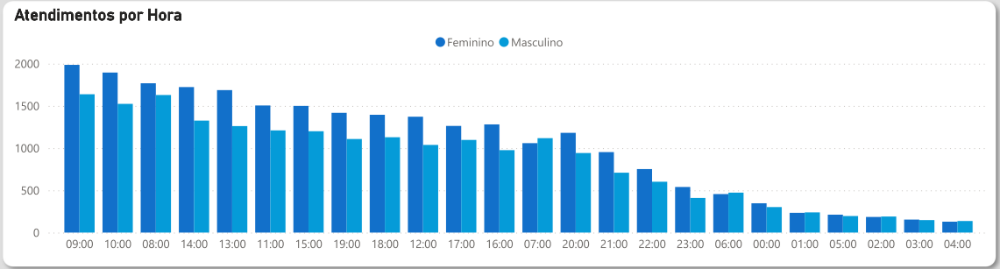
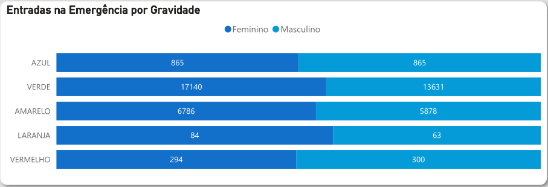

# 🏥 Dashboard de Análise da Emergência Hospitalar

## 📌 Sobre o Projeto

Este projeto tem como objetivo analisar dados operacionais da emergência do Hospital Geral de Ipiaú (BA), com foco na identificação de padrões, gargalos e oportunidades de melhoria no atendimento.

A análise foi desenvolvida a partir de dados reais, extraídos de relatórios do sistema hospitalar, permitindo uma visão detalhada do fluxo assistencial.

---

## 🎯 Problema de Negócio

A gestão de emergências hospitalares enfrenta desafios como:

* Alto volume de atendimentos
* Longos tempos de espera
* Sobrecarga da equipe médica
* Dificuldade na identificação de gargalos operacionais

Diante disso, torna-se essencial transformar dados operacionais em informações estratégicas para apoiar a tomada de decisão.

---

## 🧩 Objetivo

* Analisar o fluxo de pacientes na emergência
* Identificar padrões de demanda
* Avaliar tempos de atendimento
* Apoiar decisões operacionais e estratégicas

---

## ⚙️ Processo de Dados (ETL)

### 🔹 Extração (Extract)

* Dados obtidos a partir de relatórios em PDF do sistema hospitalar (AGHUse)

### 🔹 Transformação (Transform)

* Limpeza e padronização dos dados
* Tratamento de inconsistências
* Integração de 10 meses de dados operacionais
* Criação de variáveis analíticas

### 🔹 Carga (Load)

* Modelagem no Power BI
* Construção de dashboard interativo

---

## 📊 Dashboard e Principais Insights

### 🔹 Visão Geral do Sistema



**Insight:**
O volume total de atendimentos (mais de 45 mil) indica alta demanda contínua na emergência, sugerindo pressão operacional constante ao longo do período analisado.

---

### 🔹 Indicadores Estratégicos (KPIs)



**Insight:**
O tempo médio total de atendimento ultrapassa **8 horas**, evidenciando um possível gargalo operacional e indicando necessidade de otimização no fluxo de atendimento.

---

### 🔹 Tempo de Atendimento



**Insight:**
Os tempos de espera variam ao longo do dia, com aumento em horários de maior demanda, sugerindo desalinhamento entre volume de pacientes e capacidade de atendimento.

---

### 🔹 Padrão de Demanda



**Insight:**
A maior concentração de atendimentos ocorre durante o período diurno, indicando necessidade de maior alocação de recursos nesses horários para reduzir sobrecarga.

---

### 🔹 Perfil dos Atendimentos (Gravidade)



**Insight:**
A predominância de casos classificados como **baixa gravidade (verde e amarelo)** sugere uso da emergência para atendimentos não críticos, impactando o tempo de espera para casos mais graves.

---

## 🛠️ Ferramentas Utilizadas

* Python
* Power BI
* Excel

---

## 💡 Impacto do Projeto

Este projeto permite:

* Identificar gargalos no atendimento
* Apoiar decisões de alocação de equipe
* Melhorar a eficiência operacional
* Reduzir tempos de espera
* Otimizar o fluxo de pacientes

---

## 🚀 Possíveis Melhorias Futuras

* Automatização do pipeline de dados (ETL)
* Integração com banco de dados
* Atualização em tempo real
* Criação de alertas para horários críticos

---

## 📁 Estrutura do Repositório

```
📁 hgi-dashboard
 ┣ 📄 README.md
 ┣ 📄 dashboard_emergencia_hospitalar.pdf
 ┣ 📁 images
 ┃ ┣ overview.png
 ┃ ┣ kpis.png
 ┃ ┣ tempo_atendimento.png
 ┃ ┣ demanda.png
 ┃ ┗ gravidade.png
```

---

## 👨‍💻 Autor

**Higgor Sampaio Alves**

🔗 LinkedIn: https://linkedin.com/in/higgor-sa
🔗 GitHub: https://github.com/higgor-s-a
